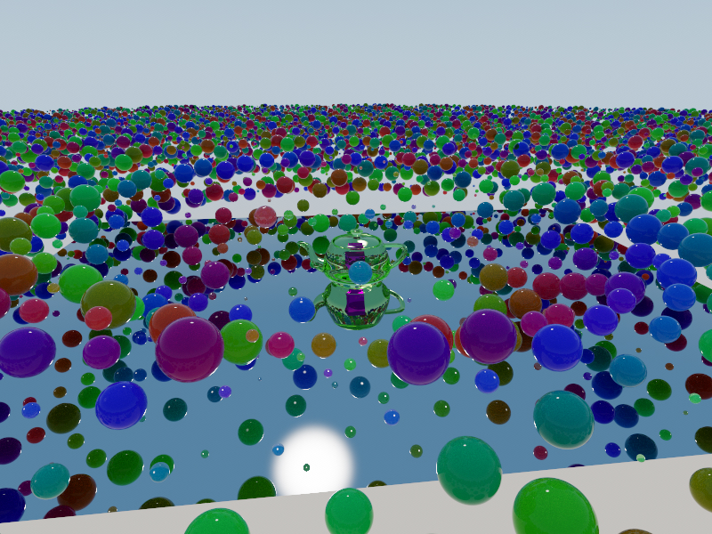

# PolyWater 



A modular rendering framework designed to support **multiple platforms** and **multiple graphics backends** (e.g., Vulkan, Direct3D12, Metal, WebGPU).
It can be used for both **rasterization** and **ray tracing**, with a focus on modularity, extensibility, and maintainability.

Parts of this framework were written with help from AI.

---

## Features

### Generic Features

**Scene & Asset Pipeline**
- glTF scene loading with support for meshes, materials, instances, and lights
- Geometry picker for interactive object selection in the scene
- Scene manager with support for instancing and scene graph traversal

**Shading & Materials**
- Slang-based shader library shared between C++ and GPU (cross-platform shaders)
- PBR metallic-roughness material model with anisotropic GGX-Smith microfacet BRDF
- Material types: Diffuse (Lambertian), Mirror, Dielectric (with refraction/transmission), Emissive, Volumetric (participating media with Henyey-Greenstein phase function), and Normals (debug visualisation)

**Lighting**
- Analytical light types: Point, Spot, and Directional
- Area lights with triangle-mesh emitters and CDF-based importance sampling
- Environment map (HDR) with 2D CDF importance sampling
- Procedural sky with configurable sun direction, color, and intensity

**Post-Processing**
- HDR tonemapping compute pipeline
- Auto-exposure via luminance histogram with temporal smoothing (mean/median modes, center-weighted metering)
- Intel Open Image Denoise (OIDN v2+) AI denoiser with GPU external-memory path and CPU fallback

**Application Framework**
- ImGui-based UI with dockable windows, property editors, and widget system
- Camera manipulator (orbit/fly)
- CLI parameter parsing and registry
- GPU monitor (NVML-backed hardware metrics)
- Integrated profiler with scoped CPU timers and GPU timer queries
- Frame pacer

---

### Vulkan Features

**Render Pipelines** (switchable at runtime)
- **Raster** — forward rasterisation pass with glTF PBR shading and bindless textures, sky compute pass, HDR tonemapping
- **Meshlet** — task + mesh shader pipeline with per-meshlet culling, hierarchical-Z (Hi-Z) occlusion buffer built via mip-reduction compute pass, sky pass, HDR tonemapping
- **Raytrace** — full path-tracing pipeline (see below), HDR tonemapping, optional OIDN denoise pass

**Path Tracing**
- Hardware-accelerated ray tracing via `VK_KHR_ray_tracing_pipeline`
- Multi-bounce path tracing with configurable maximum bounce depth
- Russian Roulette path termination
- Per-pixel multi-sample anti-aliasing with stratified jitter
- Temporal accumulation across frames
- Per-material closest-hit shaders (PBR/glTF, Diffuse, Mirror, Dielectric, Volumetric, Emissive)
- Shadow visibility rays
- Power-CDF direct-light sampling (analytical + area + environment map, proportional to emitted power)
- First-hit albedo and world-space normal G-buffers for denoiser input

**Acceleration Structures**
- Automatic TLAS/BLAS build and incremental rebuild on scene changes
- Per-material shader-binding-table (SBT) layout managed by the shader manager

**Rendering Infrastructure**
- Bindless descriptor model (global texture/buffer arrays)
- Modular render-graph with declarative pass dependencies and resource barriers
- Swapchain management with multi-frame-in-flight synchronisation
- Slang → SPIR-V compilation pipeline with runtime shader reload
- G-buffer management (Linear, Denoised, Albedo, Normal outputs)
- GPU profiling via `nvvk::ProfilerGpuTimer` (optional, compiled with `PROFILE_APP`)

---

## Project Structure

### Source (`src/`)
```
src/
├─ app/                     # Application layer
│  ├─ cli/                  # CLI parameter parsing and registry
│  ├─ elements/             # Application logic (Camera, Logger, Profiler, GPUMonitor)
│  └─ widgets/              # GUI widgets (ImGui wrappers, Property Editors, Windows)
│
├─ backend/                 # Low-level Render Hardware Interface (RHI)
│  ├─ interfaces/           # Abstract RHI interfaces (IRenderContext, IRenderBackend)
│  └─ vulkan/               # Concrete Vulkan implementation
│     ├─ compiler/          # Slang/SPIR-V compilation logic
│     ├─ core/              # Context, Swapchain, and Frame Sync managers
│     ├─ gui/               # ImGui Vulkan backend integration
│     └─ nvvk/              # Nvidia Vulkan wrappers (Allocators, Barriers, RayTracing)
│
├─ core/                    # Engine utilities (No graphics deps)
│  ├─ shape/                # Geometric primitives
│  └─ [utils]               # Math, Logging, File I/O, Profiling, Timers
│
├─ renderer/                # High-level Rendering Logic
│  ├─ interfaces/           # Render interfaces (IRenderGraph, IToneMapper)
│  └─ vulkan/               # Vulkan-specific renderer implementation
│     ├─ passes/            # Render Passes (Raster, RayTrace, Sky, ToneMap, UI)
│     └─ Renderer.cpp       # Main rendering loop orchestration
│
├─ scene/                   # Scene Management
│  ├─ gltf/ & obj/          # Asset loaders
│  ├─ Scene.h               # Scene graph definitions
│  └─ SceneManager          # Asset registry and scene traversal
│
└─ shaders/                 # Slang Shader Library
   ├─ entrypoints/          # Shader Stages
   │  ├─ compute/           # Sky, Tonemapping
   │  ├─ raster/            # GLTF Rasterization
   │  └─ raytrace/          # Raygen, Miss, Hit groups (PBR, Mirror, Shadow)
   ├─ include/              # Shared Shader Code
   │  ├─ bsdf/              # BRDF/BSDF functions (Dielectric, Diffuse, GGX)
   │  ├─ core/              # Math, Random, Sampling utilities
   │  └─ light/             # Lighting and Sky functions
   └─ shared/               # C++/Slang shared structs and bindings
```

### INSTALLATION

## Cloning
```
$ git clone --recursive git@github.com:HnimNart/VulkanRenderer.git
```

In case you forgot:
```
git submodule init
git submodule update
```

## Post Cloning
```
# Download Vulkan SDK and unpack inside 'ext' directory
# Vulkan SDK homepage: https://vulkan.lunarg.com/sdk/home
# Example (replace VERSION with desired version):
# wget -O vulkansdk.tar.gz https://sdk.lunarg.com/sdk/download/VERSION/linux/vulkan-sdk-VERSION.tar.gz
# mkdir -p ext
# tar -xzf vulkansdk.tar.gz -C ext

# Basic X11 development libraries
$ sudo apt install libx11-dev libxrandr-dev libxinerama-dev libxcursor-dev libxi-dev libxxf86vm-dev

# Additional XCB libraries
$ sudo apt install libxcb1-dev libxcb-keysyms1-dev

# Threading and OpenGL support
$ sudo apt install libtbb-dev libgl-dev


# Optional
$ sudo apt install ccache
```

## Build

A `Makefile` is provided as a convenience wrapper around CMake. It uses CMake presets defined in `CMakePresets.json`.

### Available presets

| Preset | Build type | Notes |
|---|---|---|
| `release` | Release (`-O3`) | Default |
| `debug` | Debug (`-g -O0`) | Full debug info and warnings |
| `relwithdebinfo` | RelWithDebInfo (`-O2 -g`) | Optimised with debug symbols |
| `dev` | RelWithDebInfo | Alias for `relwithdebinfo` |

### Configure

Run the CMake configure step (generates build files in `build/`):

```sh
make configure              # uses the default 'release' preset
make configure preset=debug
```

### Build

Compile the project (runs configure automatically if needed):

```sh
make build                  # release build
make build preset=debug     # debug build
```

To do a clean rebuild from scratch:

```sh
make rebuild preset=release
```

### Install

```sh
make install
```

### Run an application

Use the `run_<target>` pattern to build and then execute a binary. The binary is looked up under `build/bin/<ConfigType>/`.

```sh
make run_new_world                          # run the Vulkan app
make run_new_world args="--scene foo.json"  # pass extra arguments
```

### Run unit tests

Builds and runs the standalone test suite (no Vulkan/GLFW/Slang required):

```sh
make test
```

### Clean

Remove the build directory and clear the ccache and model cache:

```sh
make clean
```

To remove only the downloaded model cache:

```sh
make clear_cache
```

### Quick reference

```sh
make help
```


## TODOS
- [x] Scene Loader & Specification: Finalize the glTF/JSON scene schema.
- [ ] Add SceneSaver support
- [ ] Profiling Integration: Evaluate NVIDIA Nsight Graphics vs. Nsight Systems.
- [ ] Concurrent Rendering: Explore multi-queue submission or async compute.
- [ ] Add a geometry picker and widget
- [x] Add OIDN denoiser
- [ ] Add Mac OS support
- [ ] Add probe light/light cuts rendering
- [ ] Add support for 16-bit indices
- [ ] Check if this works on windows
- [x] Add back profiling for vulkan backend
- [ ] Add collision detector
